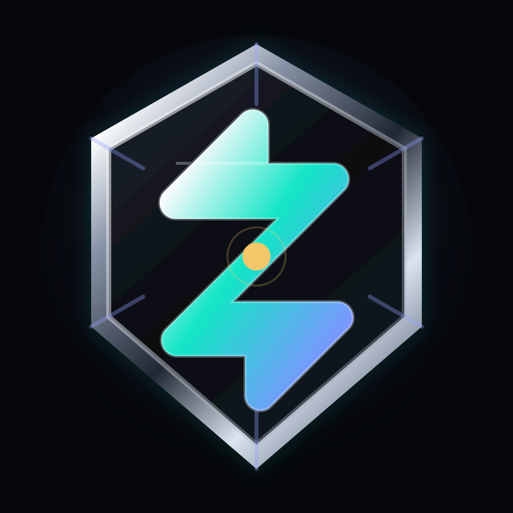

<!DOCTYPE html>
<html lang="ko">
<head>
  <meta charset="UTF-8" />
  <meta name="viewport" content="width=device-width, initial-scale=1.0" />
  <meta http-equiv="Cache-Control" content="no-store, no-cache, must-revalidate" />
  <meta http-equiv="Pragma" content="no-cache" />
  <meta http-equiv="Expires" content="0" />
  <title>Zenthex</title>
  
</head>
<body>
  <nav class="nav">
    
ZENTHEX

    

      <a href="static/studio.html?v=20260615-stock">Studio</a>
      <a href="static/finance.html?v=20260615-stock">Trading</a>
      <a href="static/stock.html?v=20260615-stock">Stock</a>
      <a href="static/login.html?v=20260615-stock">로그인</a>
    

  </nav>
  <main class="shell">
    <section class="hero">
      

        Studio + Trading + Stock SaaS
        <h1>Zenthex</h1>
        
Zenthex는 AI 건축/3D 스튜디오, 코인 자동매매, 주식 장기·전략 투자를 하나의 브랜드로 운영하는 SaaS 플랫폼입니다.

        

          <a class="cta main" href="static/studio.html?v=20260615-stock">Studio 열기</a>
          <a class="cta trade" href="static/finance.html?v=20260615-stock">Trading 열기</a>
          <a class="cta stock" href="static/stock.html?v=20260615-stock">Stock 열기</a>
          <a class="cta sub" href="static/customer.html?v=20260615-stock">고객센터</a>
        

      

    </section>
    <section class="cards">
      <article class="card">
        <h2>Zenthex Studio</h2>
        
프롬프트와 2D 도면을 건축형 3D 이미지와 향후 GLB 모델로 확장합니다.

        
AI 건축JPGGLB 확장

      </article>
      <article class="card">
        <h2>Zenthex Trading</h2>
        
상승 확인 조건을 통과한 코인만 검토하고 목표 익절, 손절선, 수익보호가로 수익 창출을 목표로 합니다.

        
UpbitBithumbBinance리스크 관리

      </article>
      <article class="card">
        <h2>Zenthex Stock</h2>
        
저평가, 성장성, 호재, 실적 개선, 장기 추세를 함께 보는 미래지향형 주식 전략 라인입니다.

        
장기 투자저평가호재 분석Paper Trading

      </article>
    </section>
    
Zenthex Trading과 Zenthex Stock은 수익 창출을 목표로 설계되는 자동매매/전략 실행 도구이지만, 투자 자문 또는 수익 보장 서비스가 아닙니다. 모든 투자 판단과 손익 책임은 사용자 본인에게 있습니다.

  </main>
  
</body>
</html>
